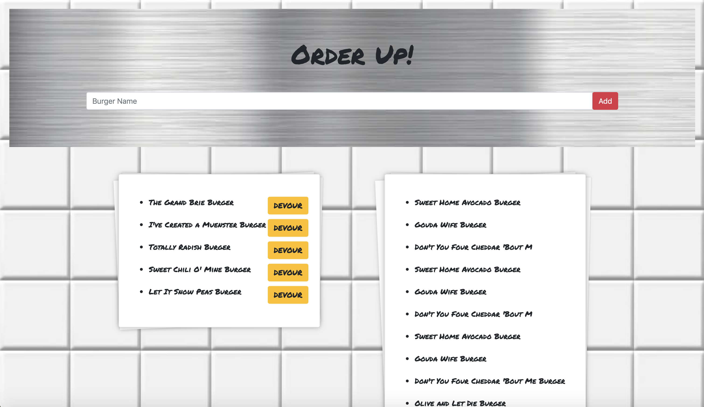

# BurgerShop
Welcome to the Burger Shop! Here you can order a fun burger and devour either the one you created or one of the existing ones! 
This app is created using Node.js, Express.js, and Handlebars.js.

## Live and Demo 
Check out the app live: https://nameless-anchorage-72173.herokuapp.com/
Watch a demo to see the app in action: https://drive.google.com/file/d/1cmC9ErbRX62eloY6u1LVTotk2GEIkcGY/view

## How to Use

<ol>
<li> Enter a fun burger name </li>
<li> The burger name will appear on the left hand order ticket with a "devour" button
<li> When the "devour" button is clicked, the burger will join the rest of the devoured burgers on the right hand order ticket </li>
</ol>